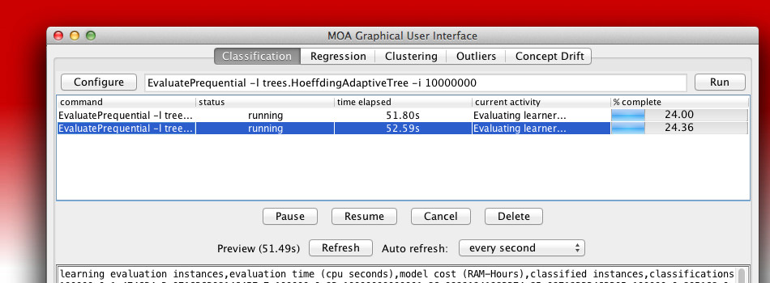

## Machine Learning for Data Streams

[MOA](https://moa.cms.waikato.ac.nz/) is the most popular open source framework for data stream mining, with a very active growing community ([blog](https://moa.cms.waikato.ac.nz/blog/)). It includes a collection of machine learning algorithms ([classification, regression](https://moa.cms.waikato.ac.nz/details/classification/), [clustering](https://moa.cms.waikato.ac.nz/details/stream-clustering/), [outlier detection](https://moa.cms.waikato.ac.nz/details/outlier-detection/), concept drift detection and [recommender systems](https://moa.cms.waikato.ac.nz/details/recommender-systems/)) and tools for evaluation. Related to the WEKA project, MOA is also written in Java, while scaling to more demanding problems. [A new book on MOA has been published at MIT Press.](https://moa.cms.waikato.ac.nz/book/s)