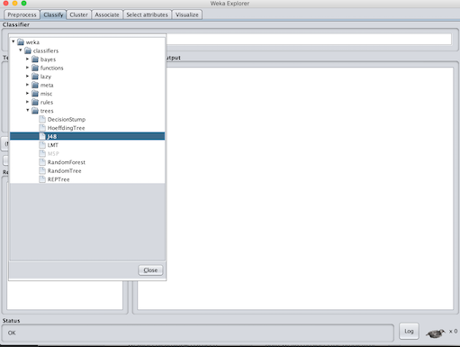

 

# Weka

[WEKA](https://www.cs.waikato.ac.nz/ml/weka/) (Waikato Environment for Knowledge Analysis) is an open source machine learning software in JAVA. It contains tools for data preparation, classification, regression, clustering, association rules mining, and visualization.

It is one of the oldest available machine learning systems available, having started development in 1993, and it is still very active in the machine learning / data mining / AI space.

### Machine Learning without Programming
Weka can be used to build machine learning pipelines, train classifiers, and run evaluations without having to write a single line of code:

#### Open dataset

#### Choose Classifier

#### Evaluate predictive accuracy

